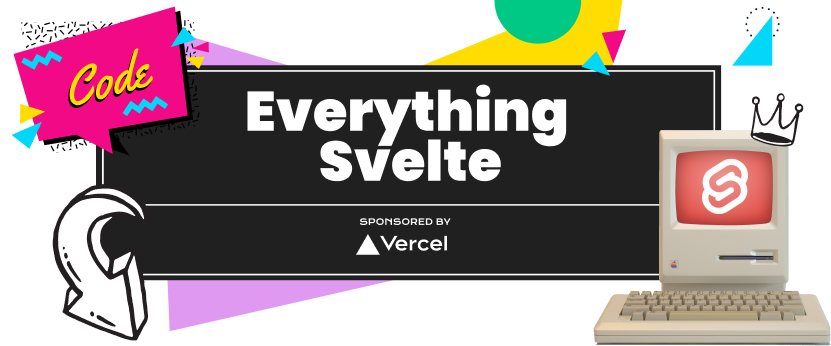

# Everything Svelte, Dollar Holler Demo

This code supports the [Everything Svelte](https://everythingsvelte.com)
course, where we're building a demo app, **The Dollar Holler.**

Here, you will find the stepped solutions that correspond with each of the
lessons. Each lesson's folder represents that lesson in its finished state.

For example, if you're starting lesson 14, then you will start with the
**13\_\_RESPONSIVE-DASHBOARD** folder to follow-along. Once complete, check your
work against the **14\_\_INVOICE-LIST** folder.

## Installation

When you start working with the lesson code, inside each folder, run:

```bash
  yarn install
  yarn dev
```

## Authors

- [@ahaywood](https://www.github.com/ahaywood)

## Support

For support, email [support@everythingsvelte.com](mailto:support@everythingsvelte.com).
